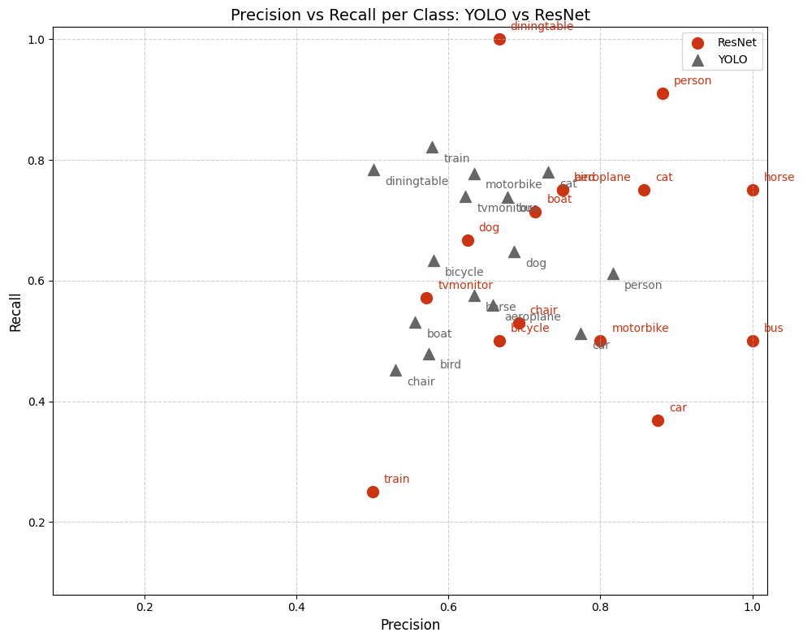

# Pascal VOC Object Detection Comparison – ResNet vs YOLO  
Evaluating classification and detection performance on the Pascal VOC dataset.  

---

## Motivation

1. After extensive experience with classificaiton for my dissertation, I wanted to expand my toolkit to include object detection. I'm excited to see what happens when localization is added to the mix!
2. I wanted to see what it was like to use AI as a coding assistant. I primarily used chatGPT. My favorite part -- aside from it being awesome at remembering syntax -- I LOVED the questions chatGPT developed (when prompted) about the coding I had accomplished for the day. You can see its quesionts and my answers in the reports sections, which show my learning curve from this project.
---

## High-Level Takeaways

1. **Coverage vs Peak Performance:**  
   - ResNet achieves higher per-class Precision, Recall, and F1 scores for the classes it successfully classifies, but it misses 5 of 20 classes.  
   - YOLO detects all classes, ensuring full coverage, but peak per-class scores are generally lower than ResNet’s.

2. **Class-Specific Strengths:**  
   - ResNet is highly reliable for **people, horses, buses, and dining tables**, with F1 scores approaching 1.0 for some classes.  
   - YOLO performs well on train, motorbike, dining table, cat, and bus in terms of Recall, and on person, cat, and car for Precision.  
   - Critical classes (e.g., people) are better served by ResNet, while YOLO ensures no class is completely missed.

3. **Dataset Limitations:**  
   - Both models struggle on underrepresented classes (bottle, chair, cow, potted plant), highlighting the importance of addressing imbalanced data problems.

4. **Metric Insights:**  
   - F1 is a suitable common metric for comparing ResNet and YOLO due to its strong correlation with YOLO’s mAP (r = 0.92).  
   - The choice of metric should consider project priorities: high Recall is preferable when missing an object is costly, while high Precision is preferable when misclassification is costly.

5. **Practical Considerations:**  
   - ResNet is faster (10–15 min vs 30–50 min for YOLO) and better suited for high-confidence classification of common classes.  
   - YOLO provides full coverage, making it more suitable for applications where detecting all objects is critical, even if some predictions are less accurate.

**Summary:**  
ResNet is optimal for tasks requiring high-confidence detection of common classes, while YOLO is optimal for ensuring all objects are detected. Dataset imbalance limits performance on rare classes, suggesting future work in resampling the training data.

---
### **Visuals**  

 

---


## ⚙️ How to Run / Reproduce  

### 1. Clone the repository  
```bash
git clone https://github.com/yourusername/object-detection-benchmark.git
cd object-detection-benchmark
``` 

### 2. Install dependencies  
```bash
pip install -r requirements.txt
```  

### 3. Run notebooks

Launch Jupyter and open the notebooks in order:
```bash
jupyter lab
```
Then open:

    notebooks/1_setup.ipynb

    notebooks/2_preprocessing.ipynb

    notebooks/3_resnet.ipynb

    notebooks/4_yolo.ipynb

    notebooks/5_analysis.ipynb
