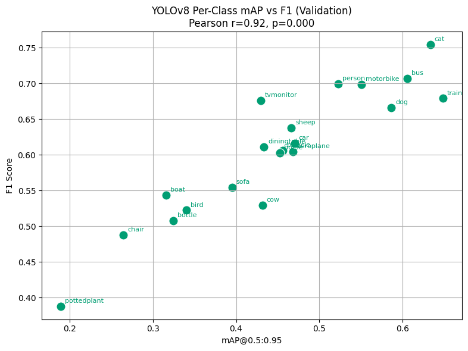
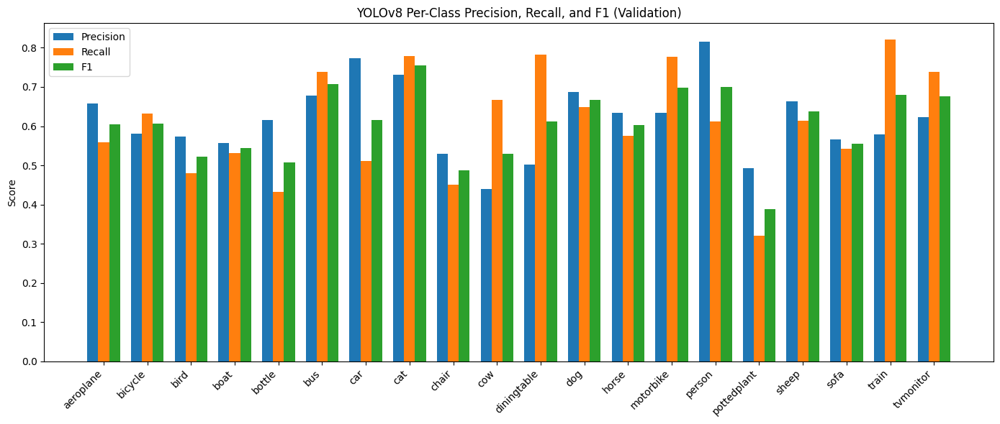

# Pascal VOC Object Detection Comparison – ResNet vs YOLO  
Evaluating classification and detection performance on the Pascal VOC dataset.  

---
## Motivation

1. After extensive work on classification problems for my dissertation, I wanted to expand my toolkit to include object detection. I was especially interested in exploring how adding localization changes performance.  

2. I also wanted to experiment with using AI as a coding assistant. I primarily worked with ChatGPT, which not only helped with syntax and debugging but also generated thoughtful reflection questions about my progress when prompted. You can see these questions and my answers in the project reports, which document my learning curve throughout the project.

---

## High-Level Takeaways

- **Coverage vs Peak Performance:**  
  - ResNet delivers higher per-class Precision, Recall, and F1 for the classes it classifies, but misses 5/20 classes.  
  - YOLO detects all classes, ensuring full coverage, but peak per-class scores are generally lower.

- **Class-Specific Strengths:**  
  - ResNet excels on **people, horses, buses, and dining tables**.  
  - YOLO performs adequately on train, motorbike, dining table, cat, and bus in Recall, and on person, cat, and car in Precision.  

- **Dataset Limitations:**  
  - Both models struggle on underrepresented classes (bottle, chair, cow, potted plant), highlighting imbalance issues.

- **Metric Insights:**  
  - F1 is an effective common metric for comparison (strong correlation with YOLO’s mAP, r = 0.92).  
  - Choice of metric depends on priorities: high Recall avoids missing objects; high Precision avoids misclassification.

- **Practical Considerations:**  
  - ResNet is faster (10–15 min vs 30–50 min) and better for high-confidence classification of common classes.  
  - YOLO provides full coverage, better for applications where missing any object is costly.

**Summary:**  
ResNet is best for high-confidence detection of common classes; YOLO is best for ensuring all objects are detected. Dataset imbalance limits rare-class performance, suggesting future work in resampling with data augmentation.

---


## ⚙️ How to Run / Reproduce  

### 1. Clone the repository  
```bash
git clone https://github.com/yourusername/object-detection-benchmark.git
cd object-detection-benchmark
``` 

### 2. Install dependencies  
```bash
pip install -r requirements.txt
```  

### 3. Run notebooks

Launch Jupyter and open the notebooks in order:
```bash
jupyter lab
```
Then open:

    notebooks/1_setup.ipynb

    notebooks/2_preprocessing.ipynb

    notebooks/3_resnet.ipynb

    notebooks/4_yolo.ipynb

    notebooks/5_analysis.ipynb

---
### **Visuals**  




 
