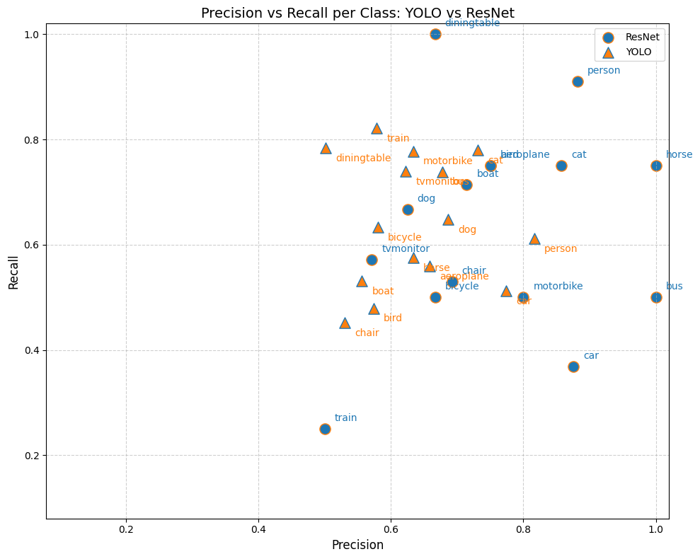

# Pascal VOC: ResNet vs YOLO
Compared ResNet classification and YOLO object detection on Pascal VOC to evaluate coverage vs peak performance trade-offs and the impact of class imbalance. ResNet is faster and excels on common classes, while YOLO ensures full class coverage.

---
## Motivation

1. Expand my ML toolkit beyond classification to object detection and explore how localization affects performance.

2. Practice reflective learning with AI assistance: I used ChatGPT to assist with debugging, syntax, and to generate reflection questions. See /development_reports for my learning curve and answers.

---

## High-Level Takeaways

- **Coverage vs Peak Performance:**  
  - ResNet delivers higher per-class Precision, Recall, and F1 for the classes it classifies, but misses 5/20 classes.  
  - YOLO detects all classes, ensuring full coverage, but peak per-class scores are generally lower.

- **Class-Specific Strengths:**  
  - ResNet excels on **people, horses, buses, and dining tables**.  
  - YOLO performs adequately on train, motorbike, dining table, cat, and bus in Recall, and on person, cat, and car in Precision.  

- **Dataset Limitations:**  
  - Both models struggle on underrepresented classes (bottle, chair, cow, potted plant), highlighting imbalance issues.

- **Metric Insights:**  
  - F1 is an effective common metric for comparison (strong correlation between YOLO’s mAP and F1, r = 0.92).  
  - Choice of Recall/Precision metric depends on priorities: high Recall avoids missing objects; high Precision avoids misclassification.

- **Practical Considerations:**  
  - ResNet is faster (10–15 min vs 30–50 min) and better for high-confidence classification of common classes.  
  - YOLO provides full coverage, better for applications where missing any object is costly.

**Summary:**  
ResNet is best for high-confidence detection of common classes; YOLO is best for ensuring all objects are detected. Dataset imbalance limits rare-class performance, suggesting future work in resampling with data augmentation.

---


## How to Run / Reproduce  

### 1. Clone the repository  
```bash
git clone https://github.com/kkmedlin/object_detection_with_pascal_voc.git
cd object_detection_with_pascal_voc
``` 

### 2. Install dependencies  
```bash
pip install -r requirements.txt
```  

### 3. Run notebooks

Launch Jupyter and open the notebooks in order:
```bash
jupyter lab
```
Then open:

    notebooks/1_setup.ipynb

    notebooks/2_preprocessing.ipynb

    notebooks/3_resnet.ipynb

    notebooks/4_yolo.ipynb

    notebooks/5_analysis.ipynb

---

### **Visuals**  



 
